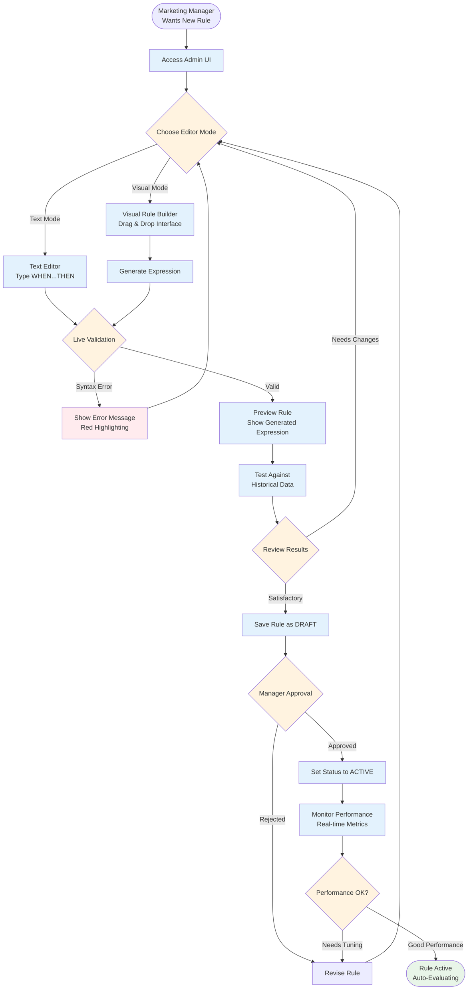
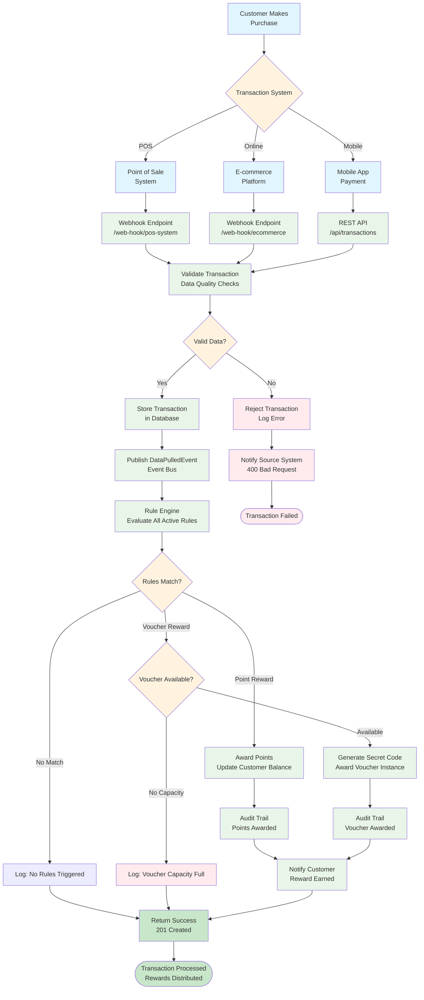
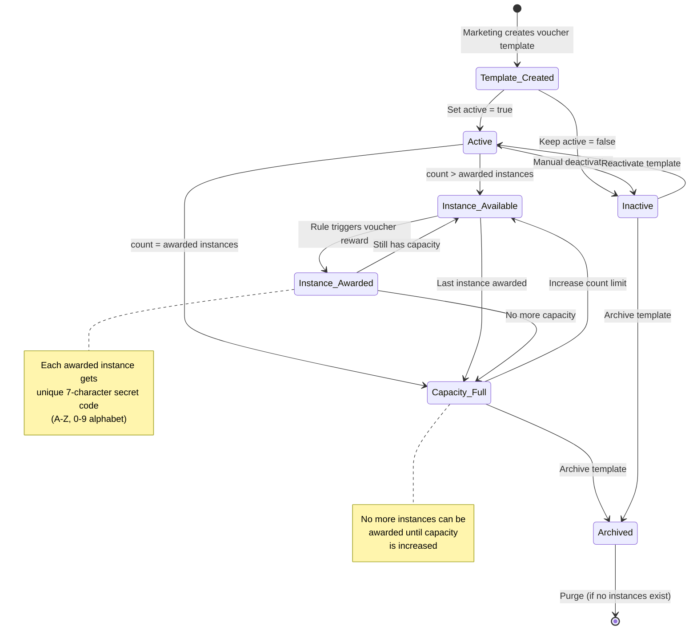
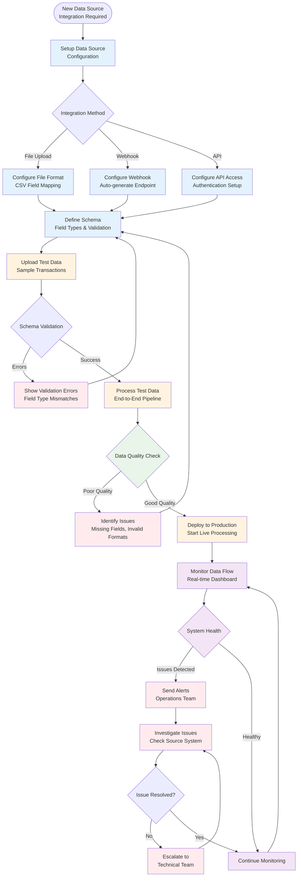

# Business Process Flow Diagrams

## Rule Creation and Management Process

```mermaid
flowchart TD
    START([Marketing Manager<br/>Wants New Rule]) --> ACCESS[Access Admin UI]
    ACCESS --> MODE{Choose Editor Mode}
    
    MODE -->|Text Mode| TEXT[Text Editor<br/>Type WHEN...THEN]
    MODE -->|Visual Mode| VISUAL[Visual Rule Builder<br/>Drag & Drop Interface]
    
    TEXT --> VALIDATE{Live Validation}
    VISUAL --> GENERATE[Generate Expression]
    GENERATE --> VALIDATE
    
    VALIDATE -->|Syntax Error| ERROR[Show Error Message<br/>Red Highlighting]
    ERROR --> MODE
    
    VALIDATE -->|Valid| PREVIEW[Preview Rule<br/>Show Generated Expression]
    PREVIEW --> TEST[Test Against<br/>Historical Data]
    
    TEST --> RESULTS{Review Results}
    RESULTS -->|Needs Changes| MODE
    RESULTS -->|Satisfactory| SAVE[Save Rule as DRAFT]
    
    SAVE --> APPROVE{Manager Approval}
    APPROVE -->|Rejected| REVISE[Revise Rule]
    REVISE --> MODE
    
    APPROVE -->|Approved| ACTIVATE[Set Status to ACTIVE]
    ACTIVATE --> MONITOR[Monitor Performance<br/>Real-time Metrics]
    
    MONITOR --> OPTIMIZE{Performance OK?}
    OPTIMIZE -->|Needs Tuning| REVISE
    OPTIMIZE -->|Good Performance| END([Rule Active<br/>Auto-Evaluating])
    
    %% Styling
    classDef process fill:#e3f2fd
    classDef decision fill:#fff3e0
    classDef error fill:#ffebee
    classDef success fill:#e8f5e8
    
    class ACCESS,TEXT,VISUAL,GENERATE,PREVIEW,TEST,SAVE,ACTIVATE,MONITOR process
    class MODE,VALIDATE,RESULTS,APPROVE,OPTIMIZE decision
    class ERROR error
    class END success
```

## Customer Transaction Processing Flow

```mermaid
flowchart TD
    CUSTOMER[Customer Makes<br/>Purchase] --> SYSTEM{Transaction System}
    
    SYSTEM -->|POS| POS[Point of Sale<br/>System]
    SYSTEM -->|Online| ECOM[E-commerce<br/>Platform]
    SYSTEM -->|Mobile| MOBILE[Mobile App<br/>Payment]
    
    POS --> WEBHOOK1[Webhook Endpoint<br/>/web-hook/pos-system]
    ECOM --> WEBHOOK2[Webhook Endpoint<br/>/web-hook/ecommerce]
    MOBILE --> API[REST API<br/>/api/transactions]
    
    WEBHOOK1 --> VALIDATE[Validate Transaction<br/>Data Quality Checks]
    WEBHOOK2 --> VALIDATE
    API --> VALIDATE
    
    VALIDATE --> INVALID{Valid Data?}
    INVALID -->|No| REJECT[Reject Transaction<br/>Log Error]
    REJECT --> NOTIFY_ERROR[Notify Source System<br/>400 Bad Request]
    
    INVALID -->|Yes| STORE[Store Transaction<br/>in Database]
    STORE --> EVENT[Publish DataPulledEvent<br/>Event Bus]
    
    EVENT --> RULE_ENGINE[Rule Engine<br/>Evaluate All Active Rules]
    
    RULE_ENGINE --> RULES{Rules Match?}
    RULES -->|No Match| LOG_NO_MATCH[Log: No Rules Triggered]
    RULES -->|Point Reward| AWARD_POINTS[Award Points<br/>Update Customer Balance]
    RULES -->|Voucher Reward| CHECK_VOUCHER{Voucher Available?}
    
    CHECK_VOUCHER -->|No Capacity| LOG_VOUCHER_FULL[Log: Voucher Capacity Full]
    CHECK_VOUCHER -->|Available| AWARD_VOUCHER[Generate Secret Code<br/>Award Voucher Instance]
    
    AWARD_POINTS --> AUDIT_POINT[Audit Trail<br/>Points Awarded]
    AWARD_VOUCHER --> AUDIT_VOUCHER[Audit Trail<br/>Voucher Awarded]
    
    LOG_NO_MATCH --> RESPONSE
    LOG_VOUCHER_FULL --> RESPONSE
    AUDIT_POINT --> NOTIFY_CUSTOMER[Notify Customer<br/>Reward Earned]
    AUDIT_VOUCHER --> NOTIFY_CUSTOMER
    
    NOTIFY_CUSTOMER --> RESPONSE[Return Success<br/>201 Created]
    NOTIFY_ERROR --> END_ERROR([Transaction Failed])
    RESPONSE --> END_SUCCESS([Transaction Processed<br/>Rewards Distributed])
    
    %% Styling
    classDef external fill:#e1f5fe
    classDef process fill:#e8f5e8
    classDef decision fill:#fff3e0
    classDef error fill:#ffebee
    classDef success fill:#c8e6c9
    
    class CUSTOMER,POS,ECOM,MOBILE external
    class WEBHOOK1,WEBHOOK2,API,VALIDATE,STORE,EVENT,RULE_ENGINE,AWARD_POINTS,AWARD_VOUCHER,AUDIT_POINT,AUDIT_VOUCHER,NOTIFY_CUSTOMER process
    class SYSTEM,INVALID,RULES,CHECK_VOUCHER decision
    class REJECT,NOTIFY_ERROR,LOG_VOUCHER_FULL,END_ERROR error
    class RESPONSE,END_SUCCESS success
```

## Voucher Lifecycle Management

```mermaid
stateDiagram-v2
    [*] --> Template_Created : Marketing creates voucher template
    
    Template_Created --> Active : Set active = true
    Template_Created --> Inactive : Keep active = false
    
    Active --> Instance_Available : count > awarded instances
    Active --> Capacity_Full : count = awarded instances
    Active --> Inactive : Manual deactivation
    
    Instance_Available --> Instance_Awarded : Rule triggers voucher reward
    Instance_Available --> Capacity_Full : Last instance awarded
    
    Instance_Awarded --> Instance_Available : Still has capacity
    Instance_Awarded --> Capacity_Full : No more capacity
    
    Capacity_Full --> Instance_Available : Increase count limit
    Capacity_Full --> Archived : Archive template
    
    Inactive --> Active : Reactivate template
    Inactive --> Archived : Archive template
    
    Archived --> [*] : Purge (if no instances exist)
    
    note right of Instance_Awarded
        Each awarded instance gets
        unique 7-character secret code
        (A-Z, 0-9 alphabet)
    end note
    
    note right of Capacity_Full
        No more instances can be
        awarded until capacity
        is increased
    end note
```

## Data Integration and Quality Process

```mermaid
flowchart TD
    START([New Data Source<br/>Integration Required]) --> SETUP[Setup Data Source<br/>Configuration]
    
    SETUP --> METHOD{Integration Method}
    METHOD -->|File Upload| FILE_CONFIG[Configure File Format<br/>CSV Field Mapping]
    METHOD -->|Webhook| WEBHOOK_CONFIG[Configure Webhook<br/>Auto-generate Endpoint]
    METHOD -->|API| API_CONFIG[Configure API Access<br/>Authentication Setup]
    
    FILE_CONFIG --> SCHEMA[Define Schema<br/>Field Types & Validation]
    WEBHOOK_CONFIG --> SCHEMA
    API_CONFIG --> SCHEMA
    
    SCHEMA --> TEST_DATA[Upload Test Data<br/>Sample Transactions]
    TEST_DATA --> VALIDATE_SCHEMA{Schema Validation}
    
    VALIDATE_SCHEMA -->|Errors| SCHEMA_ERROR[Show Validation Errors<br/>Field Type Mismatches]
    SCHEMA_ERROR --> SCHEMA
    
    VALIDATE_SCHEMA -->|Success| PROCESS_TEST[Process Test Data<br/>End-to-End Pipeline]
    PROCESS_TEST --> VERIFY_QUALITY{Data Quality Check}
    
    VERIFY_QUALITY -->|Poor Quality| QUALITY_ISSUES[Identify Issues<br/>Missing Fields, Invalid Formats]
    QUALITY_ISSUES --> SCHEMA
    
    VERIFY_QUALITY -->|Good Quality| PRODUCTION[Deploy to Production<br/>Start Live Processing]
    
    PRODUCTION --> MONITOR[Monitor Data Flow<br/>Real-time Dashboard]
    
    MONITOR --> HEALTH_CHECK{System Health}
    HEALTH_CHECK -->|Issues Detected| ALERT[Send Alerts<br/>Operations Team]
    HEALTH_CHECK -->|Healthy| CONTINUE[Continue Monitoring]
    
    ALERT --> INVESTIGATE[Investigate Issues<br/>Check Source System]
    INVESTIGATE --> RESOLVE{Issue Resolved?}
    RESOLVE -->|No| ESCALATE[Escalate to<br/>Technical Team]
    RESOLVE -->|Yes| CONTINUE
    
    CONTINUE --> MONITOR
    ESCALATE --> INVESTIGATE
    
    %% Styling
    classDef config fill:#e3f2fd
    classDef test fill:#fff3e0
    classDef error fill:#ffebee
    classDef success fill:#e8f5e8
    classDef monitor fill:#f3e5f5
    
    class SETUP,FILE_CONFIG,WEBHOOK_CONFIG,API_CONFIG,SCHEMA config
    class TEST_DATA,PROCESS_TEST,PRODUCTION test
    class SCHEMA_ERROR,QUALITY_ISSUES,ALERT,INVESTIGATE,ESCALATE error
    class MONITOR,CONTINUE,HEALTH_CHECK monitor
    class VERIFY_QUALITY success
```
