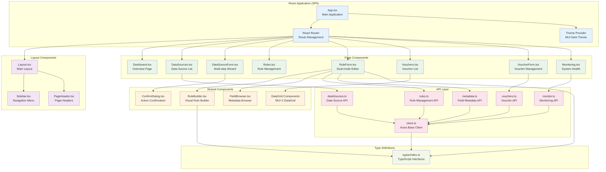

# Component Architecture and Class Diagrams

## Frontend Component Architecture



## Backend Service Architecture

```mermaid
classDiagram
    class DataSourceController {
        +GET findAll()
        +POST create()
        +GET findById()
        +PUT update()
        +DELETE archive()
        +POST uploadFile()
        +GET getSchema()
    }
    
    class RuleController {
        +GET findAll()
        +POST create()
        +GET findById()
        +PUT update()
        +DELETE delete()
        +POST validateExpression()
        +POST testRule()
    }
    
    class VoucherController {
        +GET findAll()
        +POST create()
        +GET findById()
        +PUT update()
        +DELETE archive()
        +POST award()
        +GET getInstances()
    }
    
    class WebhookIngestionController {
        +POST ingestData()
        +GET getEndpointInfo()
    }
    
    class DataSourceService {
        <<interface>>
        +findAll()
        +save()
        +findById()
        +archiveById()
        +processFile()
        +validateSchema()
    }
    
    class DataSourceServiceImpl {
        -DataSourceRepository repository
        -FileProcessingService fileService
        -ApplicationEventPublisher eventPublisher
        +findAll()
        +save()
        +findById()
        +archiveById()
        +processFile()
        +validateSchema()
    }
    
    class RuleService {
        <<interface>>
        +findAll()
        +save()
        +findById()
        +validateExpression()
        +evaluateRule()
    }
    
    class RuleServiceImpl {
        -RuleRepository repository
        -RuleParser ruleParser
        -RuleEvaluator ruleEvaluator
        +findAll()
        +save()
        +findById()
        +validateExpression()
        +evaluateRule()
    }
    
    class VoucherService {
        <<interface>>
        +findAll()
        +save()
        +findById()
        +award()
        +validateCode()
    }
    
    class VoucherServiceImpl {
        -VoucherRepository voucherRepo
        -VoucherInstanceRepository instanceRepo
        -SecureRandom secureRandom
        +findAll()
        +save()
        +findById()
        +award()
        +validateCode()
        -generateUniqueCode()
    }
    
    class RuleParser {
        +parse(expression) ParsedRule
        -lexer(expression) TokenStream
        -parseWhenClause() LogicalNode
        -parseThenClause() RewardSpec
    }
    
    class RuleEvaluator {
        +evaluate(rule, record) boolean
        +evaluateCondition(condition, record) boolean
        -coerceType(value, targetType) Object
    }
    
    class RuleEvaluationService {
        -List~Rule~ activeRules
        -RuleEvaluator evaluator
        -VoucherService voucherService
        +evaluateAll(records) List~EvaluationResult~
        +@EventListener handleDataPulled()
    }
    
    %% Relationships
    DataSourceController --> DataSourceService
    RuleController --> RuleService
    VoucherController --> VoucherService
    WebhookIngestionController --> DataSourceService
    
    DataSourceService <|.. DataSourceServiceImpl
    RuleService <|.. RuleServiceImpl
    VoucherService <|.. VoucherServiceImpl
    
    RuleServiceImpl --> RuleParser
    RuleServiceImpl --> RuleEvaluator
    RuleEvaluationService --> RuleEvaluator
    RuleEvaluationService --> VoucherService
    
    %% Styling
    classDef controller fill:#e3f2fd
    classDef service fill:#e8f5e8
    classDef impl fill:#fff3e0
    classDef engine fill:#fce4ec
    
    class DataSourceController,RuleController,VoucherController,WebhookIngestionController controller
    class DataSourceService,RuleService,VoucherService service
    class DataSourceServiceImpl,RuleServiceImpl,VoucherServiceImpl impl
    class RuleParser,RuleEvaluator,RuleEvaluationService engine
```

## Rule Engine Class Structure

```mermaid
classDiagram
    class ParsedRule {
        +LogicalNode condition
        +RewardSpec reward
        +toString() String
        +validate() boolean
    }
    
    class LogicalNode {
        <<interface>>
        +accept(visitor) T
        +evaluate(record) boolean
    }
    
    class AndNode {
        +LogicalNode left
        +LogicalNode right
        +accept(visitor) T
        +evaluate(record) boolean
    }
    
    class OrNode {
        +LogicalNode left  
        +LogicalNode right
        +accept(visitor) T
        +evaluate(record) boolean
    }
    
    class LeafNode {
        +Condition condition
        +accept(visitor) T
        +evaluate(record) boolean
    }
    
    class Condition {
        +FieldRef fieldRef
        +ComparisonOperator operator
        +String rawValue
        +Object coercedValue
        +FieldDataType expectedType
    }
    
    class FieldRef {
        +String sourceName
        +String fieldName
        +String fullPath
        +FieldDataType dataType
    }
    
    class RewardSpec {
        +RewardType type
        +String value
        +validate() boolean
        +isPointReward() boolean
        +isVoucherReward() boolean
    }
    
    class ComparisonOperator {
        <<enumeration>>
        GREATER_THAN
        LESS_THAN
        GREATER_THAN_OR_EQUAL
        LESS_THAN_OR_EQUAL
        EQUAL
        NOT_EQUAL
        CONTAINS
        STARTS_WITH
        ENDS_WITH
        +apply(left, right) boolean
        +getApplicableTypes() Set~FieldDataType~
    }
    
    class RewardType {
        <<enumeration>>
        POINT
        VOUCHER
    }
    
    class FieldDataType {
        <<enumeration>>
        STRING
        INTEGER
        DECIMAL
        DATE
        BOOLEAN
        +coerce(value) Object
        +getJavaType() Class
    }
    
    %% Relationships
    ParsedRule --> LogicalNode
    ParsedRule --> RewardSpec
    
    LogicalNode <|.. AndNode
    LogicalNode <|.. OrNode
    LogicalNode <|.. LeafNode
    
    AndNode --> LogicalNode : left
    AndNode --> LogicalNode : right
    OrNode --> LogicalNode : left
    OrNode --> LogicalNode : right
    LeafNode --> Condition
    
    Condition --> FieldRef
    Condition --> ComparisonOperator
    FieldRef --> FieldDataType
    RewardSpec --> RewardType
    
    %% Styling
    classDef ast fill:#e3f2fd
    classDef enum fill:#fff3e0
    classDef leaf fill:#e8f5e8
    
    class ParsedRule,LogicalNode,AndNode,OrNode,LeafNode ast
    class ComparisonOperator,RewardType,FieldDataType enum
    class Condition,FieldRef,RewardSpec leaf
```

## Event-Driven Architecture Components

```mermaid
graph TB
    subgraph "Event Publishers"
        DS_SVC[DataSourceService<br/>File Processing]
        WH_CTRL[WebhookController<br/>Data Ingestion]
        RULE_SVC[RuleService<br/>Rule Management]
    end
    
    subgraph "Application Events"
        DATA_PULLED[DataPulledEvent<br/>New Records Available]
        RULE_TRIGGERED[RuleTriggeredEvent<br/>Reward Awarded]
        RULE_SAVED[RuleSavedEvent<br/>Rule Created/Updated]
        FILE_PROCESSED[FileProcessedEvent<br/>Batch Complete]
    end
    
    subgraph "Event Listeners"
        RULE_EVAL[RuleEvaluationService<br/>@EventListener]
        RULE_SCHED[RuleScheduler<br/>@EventListener]
        AUDIT_SVC[AuditService<br/>@EventListener]
        MONITOR_SVC[MonitoringService<br/>@EventListener]
    end
    
    subgraph "External Systems"
        KAFKA[Kafka Topics<br/>External Integration]
        WEBHOOK_OUT[Outbound Webhooks<br/>Customer Notifications]
        ANALYTICS[Analytics Service<br/>Performance Tracking]
    end
    
    %% Event Flow
    DS_SVC --> DATA_PULLED
    DS_SVC --> FILE_PROCESSED
    WH_CTRL --> DATA_PULLED
    RULE_SVC --> RULE_SAVED
    
    DATA_PULLED --> RULE_EVAL
    RULE_SAVED --> RULE_SCHED
    
    RULE_EVAL --> RULE_TRIGGERED
    
    RULE_TRIGGERED --> AUDIT_SVC
    RULE_TRIGGERED --> MONITOR_SVC
    RULE_TRIGGERED --> WEBHOOK_OUT
    
    FILE_PROCESSED --> MONITOR_SVC
    FILE_PROCESSED --> ANALYTICS
    
    DATA_PULLED --> KAFKA
    RULE_TRIGGERED --> KAFKA
    
    %% Styling
    classDef publisher fill:#e3f2fd
    classDef event fill:#fff3e0
    classDef listener fill:#e8f5e8
    classDef external fill:#fce4ec
    
    class DS_SVC,WH_CTRL,RULE_SVC publisher
    class DATA_PULLED,RULE_TRIGGERED,RULE_SAVED,FILE_PROCESSED event
    class RULE_EVAL,RULE_SCHED,AUDIT_SVC,MONITOR_SVC listener
    class KAFKA,WEBHOOK_OUT,ANALYTICS external
```
