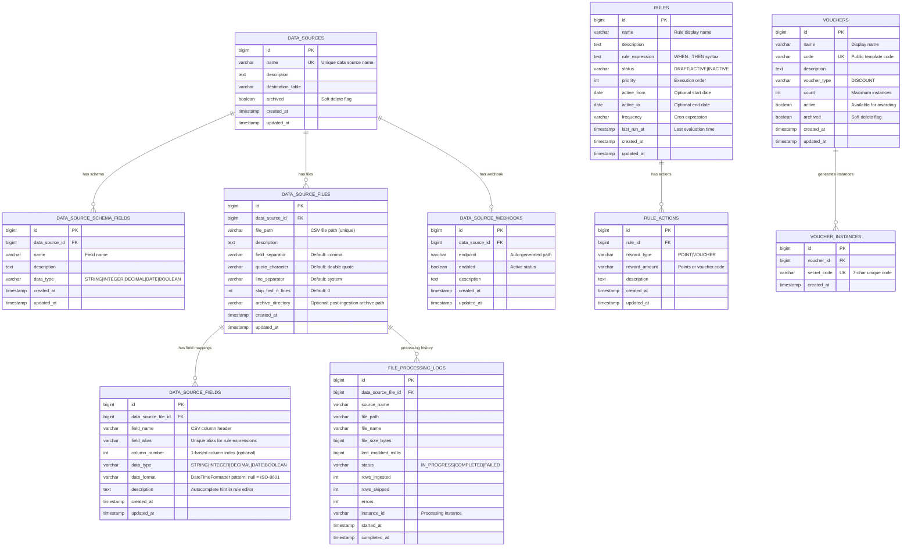

# Database Schema Diagram



## Entity Relationships and Constraints

### Primary Key Strategy
- All tables use `BIGSERIAL` for primary keys
- Provides 64-bit integer range (up to 9.2 quintillion records)
- Auto-incrementing for simple insertion

### Foreign Key Constraints
```sql
-- Data Source relationships
ALTER TABLE data_source_schema_fields 
    ADD CONSTRAINT fk_schema_fields_data_source 
    FOREIGN KEY (data_source_id) REFERENCES data_sources(id) ON DELETE CASCADE;

ALTER TABLE data_source_files 
    ADD CONSTRAINT fk_files_data_source 
    FOREIGN KEY (data_source_id) REFERENCES data_sources(id) ON DELETE CASCADE;

ALTER TABLE data_source_webhooks 
    ADD CONSTRAINT fk_webhooks_data_source 
    FOREIGN KEY (data_source_id) REFERENCES data_sources(id) ON DELETE CASCADE;

-- Rule relationships
ALTER TABLE rule_actions 
    ADD CONSTRAINT fk_actions_rule 
    FOREIGN KEY (rule_id) REFERENCES rules(id) ON DELETE CASCADE;

-- Voucher relationships  
ALTER TABLE voucher_instances 
    ADD CONSTRAINT fk_instances_voucher 
    FOREIGN KEY (voucher_id) REFERENCES vouchers(id) ON DELETE CASCADE;

-- Processing log relationships
ALTER TABLE file_processing_logs 
    ADD CONSTRAINT fk_logs_file 
    FOREIGN KEY (data_source_file_id) REFERENCES data_source_files(id) ON DELETE CASCADE;
```

### Unique Constraints
```sql
-- Business rule: Data source names must be unique
ALTER TABLE data_sources ADD CONSTRAINT uk_data_sources_name UNIQUE (name);

-- Business rule: Voucher codes must be unique (public identifiers)
ALTER TABLE vouchers ADD CONSTRAINT uk_vouchers_code UNIQUE (code);

-- Security rule: Secret codes must be globally unique
ALTER TABLE voucher_instances ADD CONSTRAINT uk_voucher_instances_secret_code UNIQUE (secret_code);
```

### Check Constraints
```sql
-- Data validation rules
ALTER TABLE rules 
    ADD CONSTRAINT chk_rules_status 
    CHECK (status IN ('DRAFT', 'ACTIVE', 'INACTIVE'));

ALTER TABLE rule_actions 
    ADD CONSTRAINT chk_rule_actions_reward_type 
    CHECK (reward_type IN ('POINT', 'VOUCHER'));

ALTER TABLE data_source_schema_fields 
    ADD CONSTRAINT chk_schema_fields_data_type 
    CHECK (data_type IN ('STRING', 'INTEGER', 'DECIMAL', 'DATE', 'BOOLEAN'));

ALTER TABLE vouchers 
    ADD CONSTRAINT chk_vouchers_count 
    CHECK (count >= 0);

ALTER TABLE voucher_instances 
    ADD CONSTRAINT chk_voucher_instances_secret_code_format 
    CHECK (secret_code ~ '^[A-Z0-9]{7}$');

ALTER TABLE file_processing_logs 
    ADD CONSTRAINT chk_file_processing_logs_status 
    CHECK (status IN ('IN_PROGRESS', 'COMPLETED', 'FAILED'));
```

### Performance Indexes
```sql
-- Query optimization indexes
CREATE INDEX idx_data_sources_archived ON data_sources(archived) WHERE archived = false;
CREATE INDEX idx_rules_status_priority ON rules(status, priority DESC) WHERE status = 'ACTIVE';
CREATE INDEX idx_rules_active_dates ON rules(active_from, active_to) WHERE active_from IS NOT NULL OR active_to IS NOT NULL;
CREATE INDEX idx_vouchers_active ON vouchers(active, archived) WHERE active = true AND archived = false;
CREATE INDEX idx_voucher_instances_voucher_id ON voucher_instances(voucher_id);
CREATE INDEX idx_file_processing_logs_status_started ON file_processing_logs(status, started_at);

-- Text search indexes
CREATE INDEX idx_data_sources_name_gin ON data_sources USING gin(to_tsvector('english', name));
CREATE INDEX idx_rules_name_expression_gin ON rules USING gin(to_tsvector('english', name || ' ' || rule_expression));
```

### Audit Triggers
```sql
-- Automatic timestamp updates
CREATE OR REPLACE FUNCTION update_updated_at_column()
RETURNS TRIGGER AS $$
BEGIN
    NEW.updated_at = NOW();
    RETURN NEW;
END;
$$ language 'plpgsql';

-- Apply to all entities with updated_at
CREATE TRIGGER update_data_sources_updated_at BEFORE UPDATE ON data_sources 
    FOR EACH ROW EXECUTE FUNCTION update_updated_at_column();
CREATE TRIGGER update_rules_updated_at BEFORE UPDATE ON rules 
    FOR EACH ROW EXECUTE FUNCTION update_updated_at_column();
CREATE TRIGGER update_vouchers_updated_at BEFORE UPDATE ON vouchers 
    FOR EACH ROW EXECUTE FUNCTION update_updated_at_column();
```
