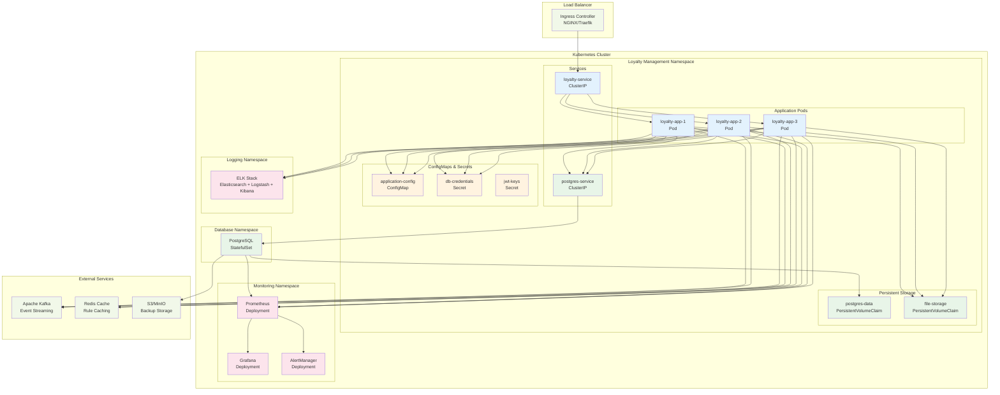
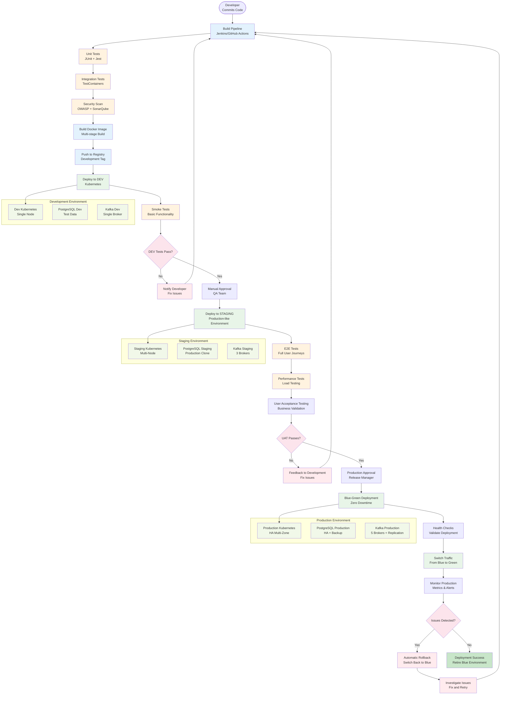
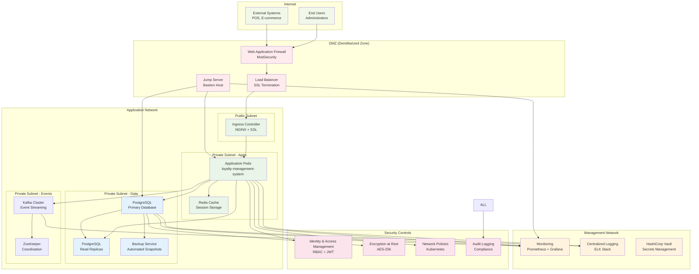

# Deployment and Infrastructure Diagrams

## Kubernetes Deployment Architecture

```mermaid
graph TB
    subgraph "Load Balancer"
        LB[Ingress Controller<br/>NGINX/Traefik]
    end
    
    subgraph "Kubernetes Cluster"
        subgraph "Loyalty Management Namespace"
            subgraph "Application Pods"
                APP1[loyalty-app-1<br/>Pod]
                APP2[loyalty-app-2<br/>Pod] 
                APP3[loyalty-app-3<br/>Pod]
            end
            
            subgraph "Services"
                APP_SVC[loyalty-service<br/>ClusterIP]
                DB_SVC[postgres-service<br/>ClusterIP]
            end
            
            subgraph "ConfigMaps & Secrets"
                CONFIG[application-config<br/>ConfigMap]
                DB_SECRET[db-credentials<br/>Secret]
                JWT_SECRET[jwt-keys<br/>Secret]
            end
            
            subgraph "Persistent Storage"
                DB_PVC[postgres-data<br/>PersistentVolumeClaim]
                FILE_PVC[file-storage<br/>PersistentVolumeClaim]
            end
        end
        
        subgraph "Database Namespace"
            DB_POD[PostgreSQL<br/>StatefulSet]
        end
        
        subgraph "Monitoring Namespace"
            PROM[Prometheus<br/>Deployment]
            GRAF[Grafana<br/>Deployment]
            ALERT[AlertManager<br/>Deployment]
        end
        
        subgraph "Logging Namespace"
            ELK[ELK Stack<br/>Elasticsearch + Logstash + Kibana]
        end
    end
    
    subgraph "External Services"
        KAFKA[Apache Kafka<br/>Event Streaming]
        REDIS[Redis Cache<br/>Rule Caching]
        BACKUP[S3/MinIO<br/>Backup Storage]
    end
    
    %% Traffic Flow
    LB --> APP_SVC
    APP_SVC --> APP1
    APP_SVC --> APP2
    APP_SVC --> APP3
    
    APP1 --> DB_SVC
    APP2 --> DB_SVC
    APP3 --> DB_SVC
    DB_SVC --> DB_POD
    
    APP1 --> KAFKA
    APP2 --> KAFKA
    APP3 --> KAFKA
    
    APP1 --> REDIS
    APP2 --> REDIS
    APP3 --> REDIS
    
    %% Configuration
    APP1 --> CONFIG
    APP2 --> CONFIG
    APP3 --> CONFIG
    
    APP1 --> DB_SECRET
    APP2 --> DB_SECRET
    APP3 --> DB_SECRET
    
    %% Storage
    DB_POD --> DB_PVC
    APP1 --> FILE_PVC
    APP2 --> FILE_PVC
    APP3 --> FILE_PVC
    
    %% Monitoring
    APP1 --> PROM
    APP2 --> PROM
    APP3 --> PROM
    DB_POD --> PROM
    
    PROM --> GRAF
    PROM --> ALERT
    
    %% Logging
    APP1 --> ELK
    APP2 --> ELK
    APP3 --> ELK
    
    %% Backup
    DB_POD --> BACKUP
    
    %% Styling
    classDef app fill:#e3f2fd
    classDef data fill:#e8f5e8
    classDef config fill:#fff3e0
    classDef monitor fill:#fce4ec
    classDef external fill:#f1f8e9
    
    class APP1,APP2,APP3,APP_SVC app
    class DB_POD,DB_SVC,DB_PVC,FILE_PVC data
    class CONFIG,DB_SECRET,JWT_SECRET config
    class PROM,GRAF,ALERT,ELK monitor
    class LB,KAFKA,REDIS,BACKUP external
```

## Container Architecture

```mermaid
graph TB
    subgraph "Application Container"
        subgraph "JVM Process"
            MAIN[Main Application<br/>Spring Boot]
            TOMCAT[Embedded Tomcat<br/>Web Server]
            HIKARI[HikariCP<br/>Connection Pool]
        end
        
        subgraph "Static Content"
            REACT_BUILD[React Build<br/>Static Files]
            API_DOCS[OpenAPI Docs<br/>Swagger UI]
        end
        
        subgraph "Configuration"
            APP_PROPS[application.yaml<br/>Environment Config]
            LOG_CONFIG[logback-spring.xml<br/>Logging Config]
        end
        
        subgraph "Health Checks"
            LIVENESS[Liveness Probe<br/>/actuator/health/liveness]
            READINESS[Readiness Probe<br/>/actuator/health/readiness]
        end
    end
    
    subgraph "Base Image Layers"
        ALPINE[Alpine Linux<br/>Base OS]
        JRE[Eclipse Temurin JRE 25<br/>Java Runtime]
        APP_LAYER[Application Layer<br/>JAR + Dependencies]
    end
    
    subgraph "External Dependencies"
        POSTGRES[(PostgreSQL<br/>Primary Database)]
        KAFKA_EXT[Kafka Cluster<br/>Event Streaming]
        REDIS_EXT[Redis<br/>Caching Layer]
    end
    
    %% Layer Dependencies
    APP_LAYER --> JRE
    JRE --> ALPINE
    
    %% Application Structure
    MAIN --> TOMCAT
    MAIN --> HIKARI
    TOMCAT --> REACT_BUILD
    TOMCAT --> API_DOCS
    
    MAIN --> APP_PROPS
    MAIN --> LOG_CONFIG
    
    %% Health Monitoring
    TOMCAT --> LIVENESS
    TOMCAT --> READINESS
    
    %% External Connections
    HIKARI --> POSTGRES
    MAIN --> KAFKA_EXT
    MAIN --> REDIS_EXT
    
    %% Styling
    classDef app fill:#e3f2fd
    classDef layer fill:#fff3e0
    classDef config fill:#f3e5f5
    classDef external fill:#e8f5e8
    classDef health fill:#fce4ec
    
    class MAIN,TOMCAT,HIKARI,REACT_BUILD,API_DOCS app
    class ALPINE,JRE,APP_LAYER layer
    class APP_PROPS,LOG_CONFIG config
    class POSTGRES,KAFKA_EXT,REDIS_EXT external
    class LIVENESS,READINESS health
```

## Multi-Environment Deployment Pipeline

```mermaid
flowchart TD
    START([Developer<br/>Commits Code]) --> BUILD[Build Pipeline<br/>Jenkins/GitHub Actions]
    
    BUILD --> UNIT_TEST[Unit Tests<br/>JUnit + Jest]
    UNIT_TEST --> INTEGRATION_TEST[Integration Tests<br/>TestContainers]
    INTEGRATION_TEST --> SECURITY_SCAN[Security Scan<br/>OWASP + SonarQube]
    SECURITY_SCAN --> BUILD_IMAGE[Build Docker Image<br/>Multi-stage Build]
    
    BUILD_IMAGE --> PUSH_DEV[Push to Registry<br/>Development Tag]
    PUSH_DEV --> DEPLOY_DEV[Deploy to DEV<br/>Kubernetes]
    
    DEPLOY_DEV --> SMOKE_TEST[Smoke Tests<br/>Basic Functionality]
    SMOKE_TEST --> DEV_SUCCESS{DEV Tests Pass?}
    
    DEV_SUCCESS -->|No| DEV_FAILURE[Notify Developer<br/>Fix Issues]
    DEV_SUCCESS -->|Yes| STAGING_APPROVAL[Manual Approval<br/>QA Team]
    
    STAGING_APPROVAL --> DEPLOY_STAGING[Deploy to STAGING<br/>Production-like Environment]
    DEPLOY_STAGING --> E2E_TEST[E2E Tests<br/>Full User Journeys]
    E2E_TEST --> PERF_TEST[Performance Tests<br/>Load Testing]
    PERF_TEST --> UAT[User Acceptance Testing<br/>Business Validation]
    
    UAT --> UAT_SUCCESS{UAT Passes?}
    UAT_SUCCESS -->|No| UAT_FAILURE[Feedback to Development<br/>Fix Issues]
    UAT_SUCCESS -->|Yes| PROD_APPROVAL[Production Approval<br/>Release Manager]
    
    PROD_APPROVAL --> BLUE_GREEN[Blue-Green Deployment<br/>Zero Downtime]
    BLUE_GREEN --> HEALTH_CHECK[Health Checks<br/>Validate Deployment]
    HEALTH_CHECK --> TRAFFIC_SWITCH[Switch Traffic<br/>From Blue to Green]
    
    TRAFFIC_SWITCH --> PROD_MONITOR[Monitor Production<br/>Metrics & Alerts]
    PROD_MONITOR --> ROLLBACK_CHECK{Issues Detected?}
    
    ROLLBACK_CHECK -->|Yes| ROLLBACK[Automatic Rollback<br/>Switch Back to Blue]
    ROLLBACK_CHECK -->|No| SUCCESS[Deployment Success<br/>Retire Blue Environment]
    
    DEV_FAILURE --> BUILD
    UAT_FAILURE --> BUILD
    ROLLBACK --> INVESTIGATE[Investigate Issues<br/>Fix and Retry]
    INVESTIGATE --> BUILD
    
    %% Environment Boxes
    subgraph "Development Environment"
        DEV_CLUSTER[Dev Kubernetes<br/>Single Node]
        DEV_DB[PostgreSQL Dev<br/>Test Data]
        DEV_KAFKA[Kafka Dev<br/>Single Broker]
    end
    
    subgraph "Staging Environment" 
        STAGE_CLUSTER[Staging Kubernetes<br/>Multi-Node]
        STAGE_DB[PostgreSQL Staging<br/>Production Clone]
        STAGE_KAFKA[Kafka Staging<br/>3 Brokers]
    end
    
    subgraph "Production Environment"
        PROD_CLUSTER[Production Kubernetes<br/>HA Multi-Zone]
        PROD_DB[PostgreSQL Production<br/>HA + Backup]
        PROD_KAFKA[Kafka Production<br/>5 Brokers + Replication]
    end
    
    DEPLOY_DEV --> DEV_CLUSTER
    DEPLOY_STAGING --> STAGE_CLUSTER
    BLUE_GREEN --> PROD_CLUSTER
    
    %% Styling
    classDef build fill:#e3f2fd
    classDef test fill:#fff3e0
    classDef deploy fill:#e8f5e8
    classDef decision fill:#fce4ec
    classDef error fill:#ffebee
    classDef success fill:#c8e6c9
    classDef env fill:#f1f8e9
    
    class BUILD,BUILD_IMAGE,PUSH_DEV build
    class UNIT_TEST,INTEGRATION_TEST,SECURITY_SCAN,SMOKE_TEST,E2E_TEST,PERF_TEST test
    class DEPLOY_DEV,DEPLOY_STAGING,BLUE_GREEN,TRAFFIC_SWITCH deploy
    class DEV_SUCCESS,UAT_SUCCESS,ROLLBACK_CHECK decision
    class DEV_FAILURE,UAT_FAILURE,ROLLBACK,INVESTIGATE error
    class SUCCESS success
    class DEV_CLUSTER,DEV_DB,DEV_KAFKA,STAGE_CLUSTER,STAGE_DB,STAGE_KAFKA,PROD_CLUSTER,PROD_DB,PROD_KAFKA env
```

## Network Security Architecture

```mermaid
graph TB
    subgraph "Internet"
        USERS[End Users<br/>Administrators]
        EXTERNAL[External Systems<br/>POS, E-commerce]
    end
    
    subgraph "DMZ (Demilitarized Zone)"
        WAF[Web Application Firewall<br/>ModSecurity]
        LB[Load Balancer<br/>SSL Termination]
        JUMP[Jump Server<br/>Bastion Host]
    end
    
    subgraph "Application Network"
        subgraph "Public Subnet"
            INGRESS[Ingress Controller<br/>NGINX + SSL]
        end
        
        subgraph "Private Subnet - Apps"
            APP_PODS[Application Pods<br/>loyalty-management-system]
            CACHE[Redis Cache<br/>Session Storage]
        end
        
        subgraph "Private Subnet - Data"
            DB[PostgreSQL<br/>Primary Database]
            DB_REPLICA[PostgreSQL<br/>Read Replicas]
            BACKUP_SVC[Backup Service<br/>Automated Snapshots]
        end
        
        subgraph "Private Subnet - Events"
            KAFKA[Kafka Cluster<br/>Event Streaming]
            ZOOKEEPER[ZooKeeper<br/>Coordination]
        end
    end
    
    subgraph "Management Network"
        MONITOR[Monitoring<br/>Prometheus + Grafana]
        LOGGING[Centralized Logging<br/>ELK Stack]
        VAULT[HashiCorp Vault<br/>Secrets Management]
    end
    
    subgraph "Security Controls"
        IAM[Identity & Access Management<br/>RBAC + JWT]
        ENCRYPT[Encryption at Rest<br/>AES-256]
        NETWORK_POLICY[Network Policies<br/>Kubernetes]
        AUDIT[Audit Logging<br/>Compliance]
    end
    
    %% Traffic Flow
    USERS --> WAF
    EXTERNAL --> WAF
    WAF --> LB
    LB --> INGRESS
    INGRESS --> APP_PODS
    
    %% Data Access
    APP_PODS --> CACHE
    APP_PODS --> DB
    APP_PODS --> DB_REPLICA
    APP_PODS --> KAFKA
    
    %% Database Replication
    DB --> DB_REPLICA
    DB --> BACKUP_SVC
    
    %% Event Streaming
    KAFKA --> ZOOKEEPER
    
    %% Management Access
    JUMP --> APP_PODS
    JUMP --> DB
    JUMP --> MONITOR
    
    %% Monitoring
    APP_PODS --> MONITOR
    DB --> MONITOR
    KAFKA --> MONITOR
    
    APP_PODS --> LOGGING
    DB --> LOGGING
    
    %% Security
    APP_PODS --> IAM
    DB --> ENCRYPT
    APP_PODS --> NETWORK_POLICY
    ALL --> AUDIT
    
    %% Security Zones
    classDef dmz fill:#ffebee
    classDef app fill:#e8f5e8
    classDef data fill:#e3f2fd
    classDef mgmt fill:#fff3e0
    classDef security fill:#fce4ec
    classDef external fill:#f1f8e9
    
    class WAF,LB,JUMP dmz
    class INGRESS,APP_PODS,CACHE app
    class DB,DB_REPLICA,BACKUP_SVC data
    class MONITOR,LOGGING,VAULT mgmt
    class IAM,ENCRYPT,NETWORK_POLICY,AUDIT security
    class USERS,EXTERNAL external
```
