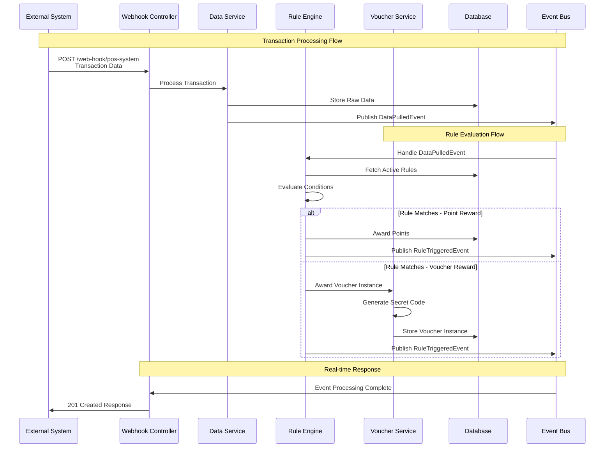

# System Architecture Diagram

```mermaid
graph TB
    subgraph "External Systems"
        POS[POS Systems]
        ECOM[E-commerce Platform] 
        MOBILE[Mobile Applications]
        CRM[CRM System]
    end
    
    subgraph "Data Ingestion Layer"
        WH[Webhook Endpoints<br/>/web-hook/{source}]
        FILE[File Upload<br/>CSV Processing]
        API[REST APIs<br/>Manual Entry]
    end
    
    subgraph "Application Layer"
        CTRL[Controllers<br/>REST Endpoints]
        SVC[Service Layer<br/>Business Logic]
        RULE[Rule Engine<br/>Parser + Evaluator]
        VOUCH[Voucher Engine<br/>Code Generator]
    end
    
    subgraph "Event Processing"
        EVT[Event Bus<br/>Spring Events]
        KAFKA[Kafka Topics<br/>Event Streaming]
    end
    
    subgraph "Data Layer"
        DB[(PostgreSQL<br/>Primary Database)]
        CACHE[(Redis Cache<br/>Rule Cache)]
    end
    
    subgraph "Frontend"
        REACT[React Admin UI<br/>TypeScript + MUI]
        VRB[Visual Rule Builder<br/>Dual Mode Editor]
    end
    
    subgraph "Monitoring"
        METRICS[Metrics<br/>Micrometer + Prometheus]
        LOGS[Logging<br/>Structured JSON]
        TRACE[Distributed Tracing<br/>Zipkin/Jaeger]
    end
    
    %% Data Flow
    POS --> WH
    ECOM --> WH
    MOBILE --> API
    CRM --> FILE
    
    WH --> CTRL
    FILE --> CTRL
    API --> CTRL
    
    CTRL --> SVC
    SVC --> RULE
    SVC --> VOUCH
    SVC --> EVT
    
    EVT --> KAFKA
    KAFKA --> SVC
    
    SVC --> DB
    SVC --> CACHE
    
    REACT --> CTRL
    VRB --> CTRL
    
    SVC --> METRICS
    SVC --> LOGS
    SVC --> TRACE
    
    %% Styling
    classDef external fill:#e1f5fe
    classDef ingestion fill:#f3e5f5
    classDef application fill:#e8f5e8
    classDef data fill:#fff3e0
    classDef frontend fill:#fce4ec
    classDef monitoring fill:#f1f8e9
    
    class POS,ECOM,MOBILE,CRM external
    class WH,FILE,API ingestion
    class CTRL,SVC,RULE,VOUCH,EVT,KAFKA application
    class DB,CACHE data
    class REACT,VRB frontend
    class METRICS,LOGS,TRACE monitoring
```

## Data Flow Architecture


